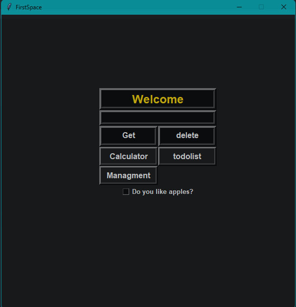
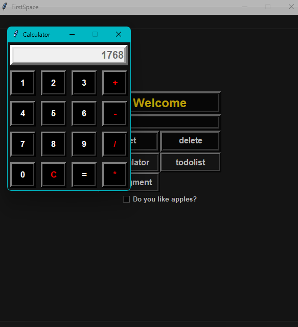
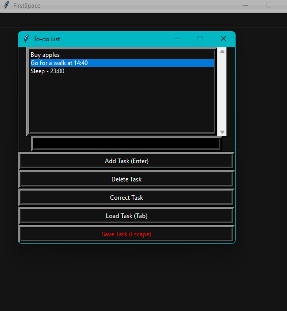
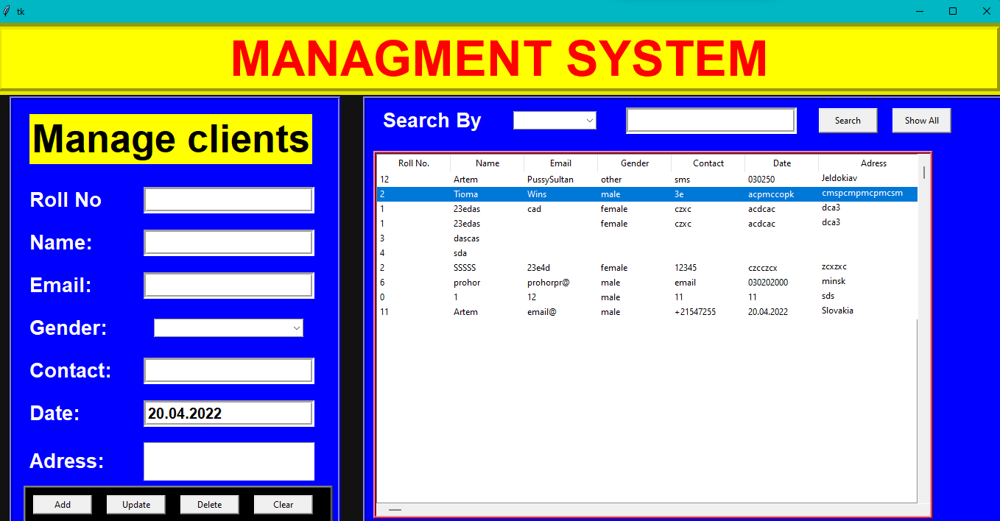

  

<h1 align="center">
  hey there
  
</h1>

# Console Application
I decided to create my first pet project, which consists of several small projects!

-To begin with, the main menu of the project welcomes us: main_menu.

-Console Calculator: You can input numbers both using the mouse and the keyboard. calculator

-To-Do List: You can save, load, and delete tasks.

-Management System: A convenient system for storing customer data.

Thank you for your attention and interest in my project!

